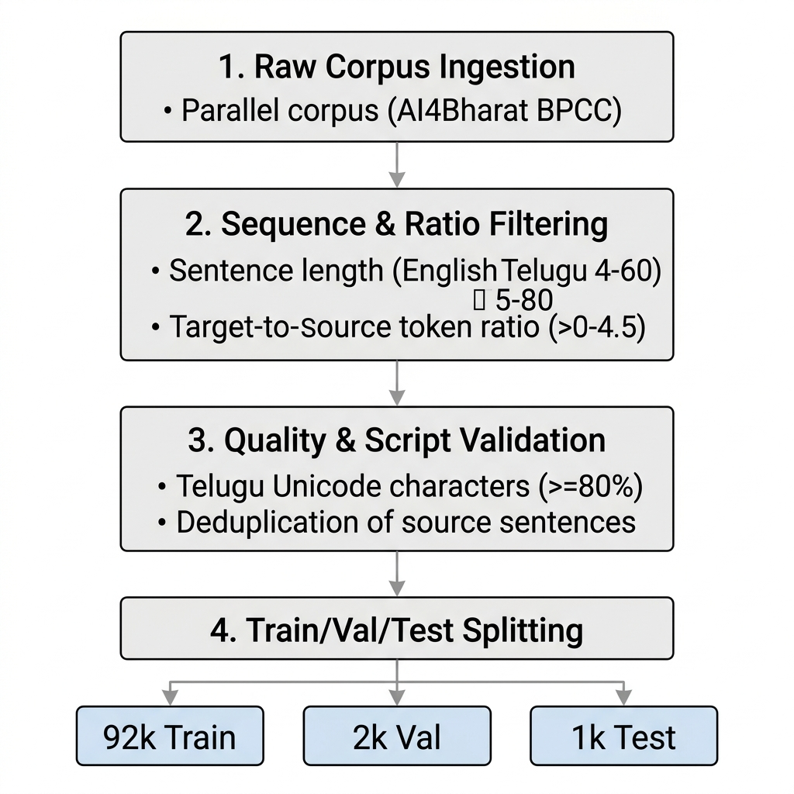
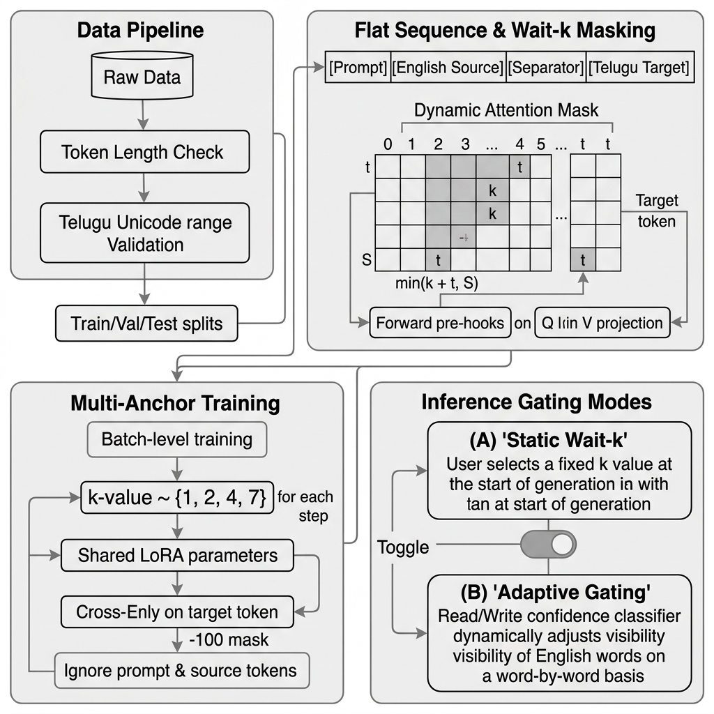

# Technical Write-up: English-to-Telugu Simultaneous Machine Translation (SiMT)

This report details the implementation of our Simultaneous Machine Translation (SiMT) pipeline using the **sarvamai/sarvam-translate** translation model (built on top of the **Gemma 3 4B** architecture). 

---

## 1. Data Engineering & Preprocessing Pipeline

We ingest the **ai4bharat/BPCC** parallel corpus (specifically the `bpcc-seed-latest` config, `tel_Telu` split), which contains human-verified English-Telugu sentence pairs. To filter out noisy, misaligned, or Romanized sentences, the raw corpus (98,117 pairs) undergoes a 5-stage cleaning pipeline:

1.  **English Source Length [4, 60] tokens:** Discards extremely short inputs (noise) and sentences longer than 60 tokens, which would dilute the simultaneous context ratio.
2.  **Telugu Target Length [5, 80] tokens:** Discards translations outside this range. We use a larger upper bound (80 tokens) because Telugu translations naturally expand relative to English.
3.  **Token Length Ratio [0.5, 5.0]:** Calculates target-to-source length ratio (Telugu tokens divided by English tokens). Telugu text is morphologically rich and has an average expansion factor of 1.76. Length ratios outside [0.5, 5.0] indicate misaligned sentences or truncated translations and are discarded.
4.  **Telugu Script Validity >= 80%:** Checks that at least 80% of non-whitespace characters in the Telugu target sentence belong to the Telugu Unicode range [U+0C00 to U+0C7F]. This automatically removes Romanized text or garbage characters.
5.  **English Source Deduplication:** Removes sentence pairs where the English source sentence has already appeared in the dataset. We do not deduplicate the Telugu target side, allowing the model to learn multiple valid translations.

### Final Dataset Partitioning (95,074 clean pairs):
*   **Test split:** 1,000 pairs (fully held out, zero source-side overlap).
*   **Val split:** 2,000 pairs.
*   **Train split:** 92,074 pairs (all remaining clean pairs; zero capping).

---

## 2. System Architecture & Wait-k Masking

Because the model is a decoder-only architecture, both source and target tokens are flattened into a single sequence:

`[System Prompt] [English Source] [Separator] [Telugu Target] [EOS]`

During dataset preprocessing, we locate three token offsets: `source_start` (start of English source), `source_end` (end of English source), and `target_start` (start of Telugu target).

Under a wait-k policy, the model reads the first `k` source tokens, then alternates between reading one source token and generating one target token. A Telugu target token at target step `t` (where `t = i - target_start` for sequence index `i`) is only allowed to attend to:
*   All prompt and separator tokens before the source.
*   Preceding generated Telugu target tokens.
*   The English source tokens up to index `max_visible = min(k + t, Source_Length)`.

Any query from target token index `i` to source token index `j` where `j - source_start >= max_visible` is blocked by adding a **-10000.0 bias** to its attention entry before the softmax calculation. We inject these masks dynamically using PyTorch **forward pre-hooks** registered on all attention blocks (specifically targeting `q_proj` and `v_proj` projections).

---

## 3. What Happens During Training (Multi-Anchor Training)

If we trained the model with a single fixed `k` (e.g., `k=4`), the model would overfit to that specific latency-quality point. It would fail or become unstable if evaluated at other values of `k`.

To make the model robust and policy-agnostic, we perform **Multi-Anchor Training**:
*   **Dynamic k Sampling:** For each training batch, we select **one** `k` value uniformly at random from `{1, 2, 4, 7}`.
*   **Batch Mask Construction:** We build the wait-k mask tensor of shape `[Batch_Size, 1, Sequence_Length, Sequence_Length]` for the batch.
*   **Hook Injection:** We register a PyTorch forward pre-hook on all self-attention layers. This hook intercepts the attention mask argument and adds our custom wait-k bias matrix to it.
*   **LoRA Optimization:** We freeze the base model in 4-bit NormalFloat (NF4) quantization and only train low-rank adaptation (LoRA) modules attached to the `q_proj` and `v_proj` attention layers (with rank `r=16`, `lora_alpha=32`).
*   **Loss Calculation:** Cross-entropy loss is computed only on the target Telugu tokens. Labels for prompt and source tokens are set to `-100` so they do not contribute to gradients.
*   **Clean Up:** Hooks are cleanly removed after each step to prevent state leakage or memory buildup.

---

## 4. What Happens During Inference

Because the model has been trained on multiple `k` values, the learned LoRA adapters are **policy-agnostic**. During generation, we perform **autoregressive decoding**:

### A. Static Gating (Inference with a User-Chosen k)
In the baseline static wait-k policy, **`k` is constant for the entire sentence during inference.** The user selects a target operating point (e.g., `k=2` for low latency, or `k=7` for high quality) at the start of generation:
*   During the token-by-token generation loop, as the sequence grows, the masking controller dynamically updates the pre-hook masks. For target step `t`, it strictly enforces `max_visible = min(k + t, Source_Length)`.
*   The value of `k` itself does not change during the sentence; it remains fixed (e.g., `k = 4`). However, the visible source window grows by exactly 1 token for every 1 target token generated because English is arriving token-by-token.
*   Because the model was trained using all anchors, a single set of LoRA adapter weights performs optimally at **any** chosen `k` (including values like `k=3` or `k=full` for standard offline translation).

### B. Adaptive Gating (Dynamic/Auto-Picked k)
If we want the system to dynamically auto-pick `k` on the fly (so `k` varies based on sentence content), we implement an **Adaptive Policy**:
*   Instead of a static masking rule, the model uses an **Emit/Read classifier** or an attention-thresholding gate at each generation step.
*   At step `t`, the model evaluates its prediction confidence (e.g., entropy of the next token distribution) or uses an auxiliary classification head:
    *   **Write (Emit):** If confidence is high, the model emits a Telugu token. The visible source window remains unchanged.
    *   **Read (Wait):** If confidence is low (e.g., the model needs more English context to predict the verb), the model reads the next English source token. This dynamically increments the visible source prefix before emitting the target token.
*   In this adaptive mode, the effective waiting period (the local wait-k) **changes dynamically** word-by-word, adapting to the complexity of the sentence.
